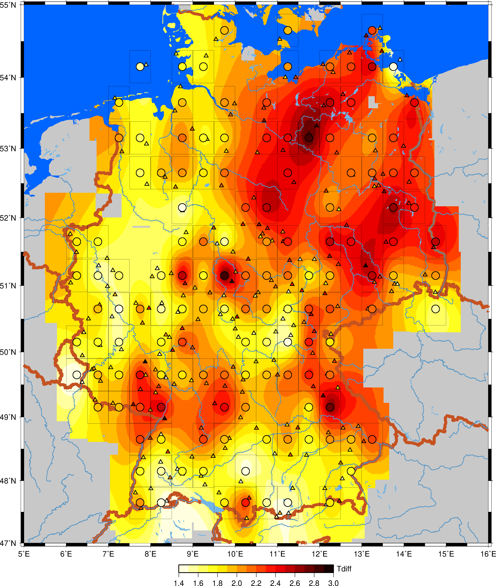

#Plot Climate data for Germany

The corresponding data and plots were discussed by Sibylle Anderl in the german cultural journal [Kursbuch](https://kursbuch.online/montagsblock-180/)

## get data from DWD 

    mkdir data
    cd data

    wget  -r -nd --no-parent -A 'terminwert*.zip' https://opendata.dwd.de/climate_environment/CDC/observations_germany/climate/subdaily/air_temperature/historical/

    for zipfile in `ls termin*zip` 
    do 
        unzip $zipfile
    done

### create dictionary for efficient data access

    python get_temperatur_dict.py

### plot Tdiff for individual weather stations in  Germany

    cd hist_plot
    python plot_temperatur_single_stations.py

comment: this plots can be regarded as definition of Tdiff

### create histogram plot for all available weather stations in Germany

    cd hist_plot
    python plot_hist_curves.py

### create map plot (using GMT 4) to compare Tdiff 

Tdiff = averageT(before 1990) to linregT(2022)

    cd map
    bash run.sh

